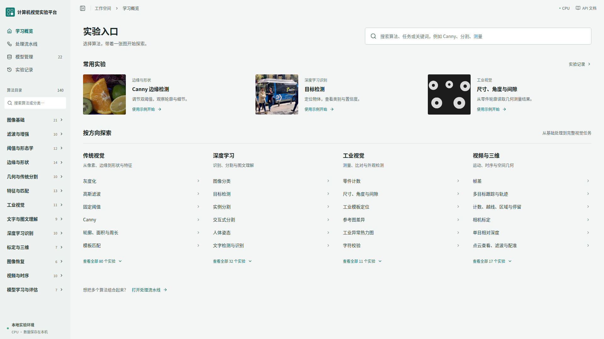
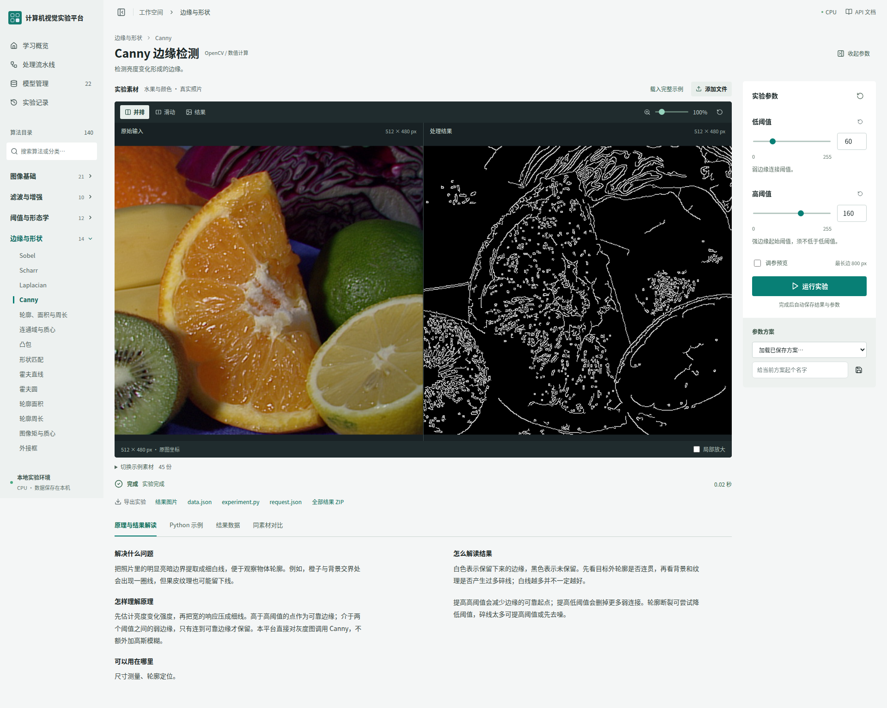

# Vision Lab · 计算机视觉交互实验室

面向计算机视觉学习与实验的中文平台。在浏览器中选择算法、载入素材、调整参数并对比处理结果，结合原理讲解和 Python 示例理解算法的使用方法。

平台提供 **140 个算法实验、13 个模块、47 份示例素材**，覆盖传统视觉、深度学习、工业视觉、视频与三维。支持 22 套预训练模型，模型准备完成后可在本地离线推理。



## 主要功能

- **交互实验**：图片、视频和点云输入，按算法生成参数控件，支持 ROI、提示点和画笔操作。
- **结果对比**：原图与结果并排、滑动或单图查看，同步缩放、独立图层和同素材历史结果对比。
- **算法学习**：针对各算法的原理、应用场景、结果解读，以及随参数更新的 Python 调用示例。
- **实验管理**：保存参数方案、查询历史记录、组合处理流水线，导出图片、视频、结构化数据和实验包。
- **本地模型**：下载、校验和管理模型文件，按需加载与释放缓存。

完整算法、输入与功能范围见 [功能清单](FEATURES.md)。



## 安装与启动

需要 Conda、Node.js 20+ 和 Git。安装脚本使用 Bash，创建 Python 3.11 环境并默认安装 CPU 版 PyTorch。包含全部模型时，建议为依赖和模型预留至少 20 GB 空间；实验素材与结果另计。

```bash
git clone https://github.com/asmellperson/vision-lab.git
cd vision-lab
bash scripts/setup_conda.sh
bash scripts/start.sh
```

打开 **http://127.0.0.1:8018**，API 文档位于 **http://127.0.0.1:8018/docs**。按 `Ctrl+C` 停止服务。

安装脚本创建 `vision-lab` 和 `vision-lab-mediapipe` 两个 Conda 环境，并构建前端。MediaPipe 使用独立环境以兼容其 NumPy 版本要求。脚本适用于尚未创建这两个同名环境的安装目录；已安装后只需执行 `bash scripts/start.sh`。

### 准备模型

传统视觉实验无需模型权重。运行深度学习等模型实验前，可在模型管理页面准备所需模型，也可在项目根目录执行：

```bash
# 按单个模型下载
conda run --no-capture-output -n vision-lab python scripts/download_models.py --model sam2

# 按模块下载
conda run --no-capture-output -n vision-lab python scripts/download_models.py --module 深度学习识别

# 下载全部模型
conda run --no-capture-output -n vision-lab python scripts/download_models.py --all
```

也可从 [模型 Release](https://github.com/asmellperson/vision-lab/releases/tag/models-2026-09-29) 下载模型包，按 [模型下载与安装说明](docs/MODEL_RELEASE.md) 校验并解压。源码仓库不包含模型权重，完整模型文件约 4.4 GiB。

模型存放在 `models/`，下载器通过 `inventory.json` 记录来源、版本、文件大小和 SHA256。模型管理页面可查看文件状态并重新校验。推理使用本地文件，不会自动下载模型或调用外部推理服务。

### 仅安装传统视觉依赖

不使用预训练模型时，可用以下步骤代替完整安装：

```bash
conda env create -f environment.yml
conda run -n vision-lab python -m pip install -r backend/requirements.txt
(cd frontend && npm ci && npm run build)
bash scripts/start.sh
```

### GPU 与配置

默认使用 CPU。使用 NVIDIA GPU 时，需安装与驱动兼容的 CUDA 版 PyTorch，并设置 `VISION_DEVICE=cuda:0`。各模型支持的设备见 [模型清单](docs/MODELS.md)。PP-OCR、U2NetP、MediaPipe 和 ONNX 对比适配器使用 CPU；TensorRT 尚未接入。

| 环境变量 | 默认值 | 用途 |
| --- | --- | --- |
| `VISION_DEVICE` | `cpu` | PyTorch / YOLO 推理设备 |
| `VISION_DATA` | 项目 `data/` | SQLite、上传素材和实验结果 |
| `VISION_MODELS` | 项目 `models/` | 模型文件目录 |
| `VISION_MEDIAPIPE_PYTHON` | 同级 `vision-lab-mediapipe/bin/python` | MediaPipe 工作进程解释器 |
| `VISION_MAX_UPLOAD_MB` | `256` | 单文件上传上限，单位 MB |
| `VISION_HOST` / `VISION_PORT` | `127.0.0.1` / `8018` | 启动脚本的监听地址与端口 |

## 开始实验

1. 在首页搜索算法，或通过左侧分类进入实验页。
2. 点击「载入完整示例」，或上传自己的素材。示例会同时填入所需的参考图、交互提示和参数。
3. 在右侧调整参数，点击「运行实验」。支持预览的算法可先使用低分辨率结果调参。
4. 在画布中对比原图与结果，查看下方的原理、Python 示例和结果数据，按需下载实验产物。

可从 **Canny 边缘检测**开始，观察高低阈值对边缘数量和连续性的影响；随后尝试形态学、特征匹配、目标检测或视频跟踪。

「Python 示例」提供两种用法：

- **算法调用**：直接使用 OpenCV、NumPy、PyTorch 等库完成当前算法。参数随页面设置更新，文件路径需替换为自己的素材路径。
- **复现实验**：使用本项目执行库复现所选素材、专用输入与参数。在项目根目录、`vision-lab` 环境下执行 `PYTHONPATH=backend python experiment.py`；更换机器后需同步素材并调整路径。

素材格式、工业参考库、测量单位、视频限制、三维输入及真值评估格式见 [实验输入与结果说明](docs/EXPERIMENTS.md)。

## 开发与测试

技术栈为 React、TypeScript、Vite、FastAPI、OpenCV、PyTorch 和 SQLite。

安装依赖后，在项目根目录启动开发服务：

```bash
bash scripts/dev.sh
```

前端地址为 **http://127.0.0.1:5178**，后端端口为 `8018`。Vite 代理 `/api`、`/docs` 和 `/openapi.json`。

```bash
# 后端测试
conda run --no-capture-output -n vision-lab python -m pytest backend/tests -q

# 前端类型检查与生产构建
(cd frontend && npm run build)
```

目录结构与算法扩展见 [架构说明](docs/ARCHITECTURE.md)，模型、视频、学习内容和浏览器测试见 [测试指南](docs/VALIDATION.md)。

## 常见问题

- **模型缺失或校验失败**：在模型管理页面检查文件状态并重新准备对应模型，或运行 `scripts/download_models.py --model <id>`。
- **MediaPipe 无法启动**：检查 `vision-lab-mediapipe` 环境。环境缺失时执行 `bash scripts/setup_mediapipe.sh`。
- **CSRT 或条码接口缺失**：其他依赖可能覆盖 OpenCV contrib，执行 `conda run -n vision-lab python -m pip install --force-reinstall --no-deps opencv-contrib-python==4.13.0.92`。
- **视频无法处理**：检查 Conda 环境中的 `ffmpeg`、`ffprobe`，并确认素材符合 [视频输入限制](docs/EXPERIMENTS.md#视频标定与三维)。
- **标定或匹配没有结果**：检查角点行列数、视角、分辨率、纹理和图像重叠范围。
- **服务重启后任务中断**：未完成任务会标记为失败，已完成记录保留，可从历史记录重新运行。

## 文档

| 文档 | 内容 |
| --- | --- |
| [功能清单](FEATURES.md) | 算法入口、输入要求与支持范围 |
| [实验输入与结果说明](docs/EXPERIMENTS.md) | 素材格式、结果单位、评估格式与导出文件 |
| [模型清单](docs/MODELS.md) | 模型来源、版本、设备、许可与文件哈希 |
| [模型下载与安装](docs/MODEL_RELEASE.md) | Release 附件下载、分卷合并和校验 |
| [架构说明](docs/ARCHITECTURE.md) | 目录职责、数据约定与扩展方法 |
| [界面设计](docs/INTERFACE.md) | 首页与 Canny 工作台的布局、样式和交互 |
| [测试指南](docs/VALIDATION.md) | 测试命令、覆盖范围与报告 |
| [第三方来源](THIRD_PARTY.md) | 模型、依赖和示例素材的许可说明 |

平台面向本地学习与实验，默认仅监听 localhost，暂不提供账号权限、多租户和分布式任务管理。第三方模型、代码与素材遵循各自的许可，使用及分发前请查阅对应来源。
