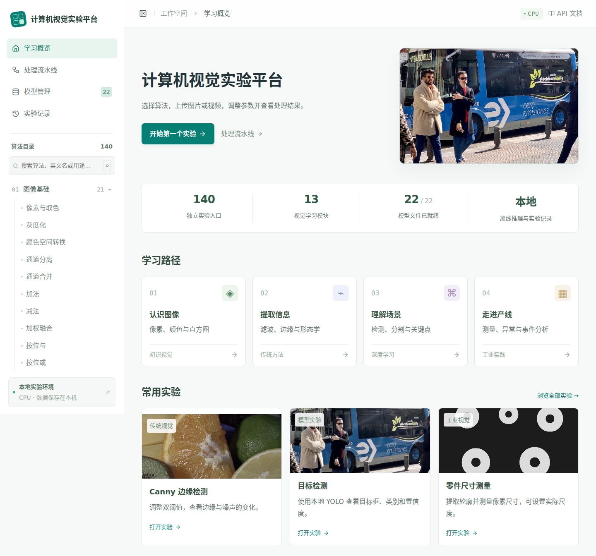

# 计算机视觉实验平台

中文计算机视觉学习与实验平台。使用 **React + TypeScript + Vite、FastAPI、OpenCV、PyTorch 和 SQLite**，围绕「选择算法 → 选择示例或上传 → 调参 → 运行 → 对比 → 下载」组织学习。

当前提供 **140 个独立实验入口、13 个模块、22 套本地模型、47 份示例素材**。模型权重、配置和词表已经下载到本项目 `models/`，约 4.4 GiB；运行实验不调用外部推理接口。详细清单见 [FEATURES.md](FEATURES.md)、[模型清单](docs/MODELS.md) 和 [验收记录](docs/VALIDATION.md)。



## 在当前机器启动

创建好两个 Conda 环境：`vision-lab` 和 `vision-lab-mediapipe`。

```bash
cd /usr/zyy/vision-lab
bash scripts/start.sh
```

打开 **http://127.0.0.1:8018**。按 `Ctrl+C` 停止。脚本会自动使用 `vision-lab` Conda 环境；API 文档位于 `http://127.0.0.1:8018/docs`。

也可以手动启动：

```bash
conda activate vision-lab
cd /usr/zyy/vision-lab
python -m uvicorn app.main:app --app-dir backend --host 127.0.0.1 --port 8018
```

如果终端提示需要先初始化 Conda，在 Bash 执行 `source /root/miniconda3/etc/profile.d/conda.sh`，再 `conda activate vision-lab`。`start.sh` 使用 `conda run`，无需激活。

## 第一次学习建议

1. 打开 **Canny**，点击「载入完整示例」，改变高低阈值，运行并切换并排/滑动对比。轻量实验可开启最长边 800 px 的调参预览；完整运行保留原始分辨率。
2. 打开 **实例分割**，载入街景或上传图片。运行后分别开关目标框、类别文字、掩膜，下载原图尺寸的 `instance_labels.png` / `.npz`。
3. 打开 **交互式分割**，用前景点、背景点或矩形框给 SAM2 提示。SVG 显示坐标会转换回原图坐标。
4. 打开 **工业异常热力图**，载入完整示例，点击「建立正常参考库」。参考库就绪后选择待检图片并运行。库文件可下载和再次上传。
5. 打开 **事件顺序规则**，载入短视频，在首帧画 ROI，设置越线位置、停留时长和事件顺序。运行后点击事件缩略图跳转到触发时间。
6. 打开 **处理流水线**，运行「灰度 → 高斯 → Otsu → 开运算 → 计数」，查看每一步，保存流程并从实验记录重新打开。

每个实验页都有原理、用途、失败原因、参数解释及与当前输入/参数一致的 Python 示例。Python 示例调用本项目的执行库，下载后在项目目录执行 `PYTHONPATH=backend python experiment.py`；输入路径仍指向本机素材。

## 在新机器安装

需要 Miniconda/Conda、Node.js 20+、可访问模型官方源的网络，以及约 15–20 GB 安装空间。Python 使用 3.11，默认安装 CPU 版 PyTorch。

```bash
cd vision-lab
bash scripts/setup_conda.sh
conda run --no-capture-output -n vision-lab python scripts/download_models.py --all
bash scripts/start.sh
```

`setup_conda.sh` 面向**尚未创建同名环境**的新机器。环境定义在 `environment.yml` 和 `environment-mediapipe.yml`；应用依赖固定在 `backend/requirements*.txt`，实测完整版本保存在两个 `requirements*.lock.txt`。前端使用 `npm ci` 和 `package-lock.json`。

MediaPipe 需要 NumPy 1.x，主环境使用 NumPy 2.x，因此采用独立 Conda 环境和本地工作进程。其他实验不依赖这个工作进程的成功启动。

只做传统视觉时，可以创建主环境后安装 `backend/requirements.txt`，再构建前端；未安装模型依赖的任务会展示实际错误，不会生成假结果。

```bash
conda env create -f environment.yml
conda run -n vision-lab python -m pip install -r backend/requirements.txt
cd frontend
npm ci
npm run build
```

开发模式：在项目根目录执行 `bash scripts/dev.sh`，前端 `http://127.0.0.1:5178`，后端 `8018`。Vite 代理 `/api`、`/docs` 和 `/openapi.json`。

## 模块、输入与输出

| 模块 | 主要输入 | 输出与注意事项 |
| --- | --- | --- |
| 图像基础 | 单图；算术/逻辑组合另加同尺寸参考图 | 像素值、颜色编码、通道、直方图、增强图片 |
| 滤波与增强 | 图片、核/强度/频域半径 | 滤波图片、频谱；核尺寸自动取奇数 |
| 阈值与形态学 | 图片、阈值/邻域/结构元素 | 二值掩膜、骨架、距离变换 |
| 边缘与形状 | 图片、阈值、最小面积 | 边缘、轮廓、坐标、面积/周长/质心/外接框、霍夫结果 |
| 几何与传统分割 | 图片；ROI/点/四边形；配准另加参考图 | 变换图片、映射矩阵、分割掩膜 |
| 特征与匹配 | 单图或参考图/模板 | 角点、描述子、匹配、RANSAC、拼接、KNN/SVM/K-means 教学示例 |
| 深度学习识别 | 图片；SAM2 另需点或框 | 分类、检测/旋转框、实例/语义/全景标签、关键点 |
| 文字与图文理解 | 图片；检索另加图库；英文提示/问题 | OCR/码内容、版面框、检索排序、文字提示框、描述/回答 |
| 图像恢复 | 图片；修复另需画笔掩膜；背景颜色 | Swin2SR ×2、Restormer 去噪/去模糊、Retinex、Telea、U2NetP alpha |
| 视频与时序 | 连续视频；跟踪/分割/事件需首帧 ROI | H.264 视频、逐帧 JSONL、事件时间轴、动作类别、分割掩膜 ZIP |
| 标定与三维 | 多视角棋盘、双目对/内外参，或 XYZ/ASCII PLY/CSV | 标定数据、视差/深度、两视图稀疏点云、滤波/平面/配准结果 |
| 工业视觉 | 模板、已对齐参考图、正常样本或规则区域 | 计数、像素/尺度测量、颜色差异、缺件规则、异常分数/热力图、字符校验 |
| 模型学习与评估 | 图片；指标实验必须有真值 | 增强/特征/Grad-CAM、分类/检测/分割指标、PyTorch/ORT 耗时 |

图像上传支持 JPEG/PNG/WebP/BMP/TIFF，按 EXIF 方向规范化后保存为 PNG，内部 BGR，浏览器显示 RGB。上限 2400 万像素。默认单文件上限 256 MB。标签图请上传**灰度标签 ID PNG**，不要用彩色可视化代替标签；当前通用图片上传转换为 8 位 RGB，因此多类别评估使用 0–255 的标签值。

每个实验的「载入完整示例」同时填写适用素材、额外输入、交互提示和演示参数。真实照片/视频与合成工业教学图明确区分，来源见 [素材清单](assets/examples/manifest.json)。如复制项目时遗漏素材，可运行 `scripts/prepare_examples.py` 与 `scripts/prepare_special_examples.py` 重新准备；这两个准备脚本需要联网。

## 模型准备、离线运行与设备

```bash
# 全部已接入模型
conda run --no-capture-output -n vision-lab python scripts/download_models.py --all
# 按中文模块准备
conda run --no-capture-output -n vision-lab python scripts/download_models.py --module 深度学习识别
# 单个模型
conda run --no-capture-output -n vision-lab python scripts/download_models.py --model sam2
```

下载器保存官方来源、版本/revision、完整文件列表、大小、SHA256。Hugging Face 模型固定到下载时的提交 SHA；修复时沿用该提交。其他权重记录发布版本和实测哈希。哈希用于检测文件损坏，**不冒充上游签名**。记录在 `models/<id>/inventory.json`，前端模型页也可查看、校验、下载、释放。

推理只读取本地文件；HF 使用 `local_files_only=True`，TorchVision 构造时关闭自动下载，ONNX OCR 使用本地权重和内嵌词表。默认仅缓存一个模型，推理加锁，后台工作线程串行处理，等待队列上限 32。轻量预览最多并发两份。不要给 Uvicorn 增加多个 workers，否则将产生各自独立的内存缓存与任务队列。

| 环境变量 | 默认值 | 用途 |
| --- | --- | --- |
| `VISION_DEVICE` | `cpu` | PyTorch/YOLO 设备，例如 `cuda:0` |
| `VISION_DATA` | 项目 `data/` | SQLite、上传和结果目录 |
| `VISION_MODELS` | 项目 `models/` | 模型目录 |
| `VISION_MEDIAPIPE_PYTHON` | 同级 `vision-lab-mediapipe/bin/python` | 独立关键点工作进程解释器 |
| `VISION_MAX_UPLOAD_MB` | `256` | 上传上限 |
| `VISION_HOST` / `VISION_PORT` | `127.0.0.1` / `8018` | `start.sh` 监听地址/端口 |

本机 NVIDIA 驱动不可用，已验证 CPU。要使用指定 GPU，先在 Conda 主环境安装与驱动匹配的 CUDA 版 PyTorch，再设置 `VISION_DEVICE=cuda:0`。PP-OCR、U2NetP、MediaPipe 和当前 ONNX 对比适配器使用 CPU。**TensorRT 没有接入和验收**；页面如实显示未运行。

## 工业实验的正确输入

异常检测是 **PatchCore 风格的教学实现**：ResNet18 layer2/layer3 特征、最近邻距离、固定随机子采样记忆库；不是论文完整复现，不使用贪心 coreset。至少 2 张、最多 100 张正常图，建议固定视角并覆盖正常光照变化。「建立参考库」生成 N×384 `features.npz`，随后可以只使用该库检测新图片。模型、预处理和特征维度必须匹配。热力图用于定位，原始 `anomaly_score.npz` 保留浮点值；分数不是概率。阈值 0 只显示连续分数，大于 0 才根据用户阈值生成区域判定。

缺件/错装使用**已对齐参考图 + ROI 差异规则**；表面缺陷实验使用局部平滑残差；字符校验使用 PP-OCR 结果与正则表达式。COCO 检测模型只支持常见 80 类，旋转框模型支持 DOTA 15 类，均不是通用工业缺陷模型。

尺寸、间隙默认 `px`，面积默认 `px²`，角度为度。只有 `pixels_per_mm > 0` 时输出毫米。该尺度适合固定平面和成像条件；单独获得相机内参并不能消除任意物体深度对尺寸的影响。

## 视频、标定与三维

视频上传后使用 FFmpeg 转为恒定帧率 H.264/AAC，保留原时长与音轨，再逐帧处理。结果采用相同 fps，恢复原音轨并加 `faststart`，浏览器可播放和定位。上限 5 分钟、4K，fps 规范化到 1–60。当前**不抽帧**，界面与导出记录均说明此条件。

帧差/MOG2/光流/CSRT/轨迹/事件/R3D/SAM2 实际利用连续帧；Canny 或单图检测处理视频时是逐帧单图推理。SAM2 的记忆传播限制 150 帧；R3D 至少需要 16 帧，输出 Kinetics-400 类别和 16 帧窗口预测。多目标 ID 使用类别约束的 IoU 关联，长遮挡和交叉可能换 ID。顺序规则支持 `enter`、`cross`、`dwell`、`exit` 与时间窗口；触发记录含 ID、轨迹位置、ROI/越线依据。

相机标定至少 5 张同分辨率、不同角度的真实棋盘照片。棋盘格边长输入真实 mm；示例图片的格子实物尺寸未知，完整示例中 1 只是演示尺度。双目校正需要同尺寸左右图及 `K1,D1,K2,D2,R,T` JSON，例子在 `assets/examples/stereo-calibration.json`。该示例 T 的尺度为棋盘格，不是毫米。SGBM 输入必须先极线校正；只有给出像素焦距与真实毫米基线，才计算 `depth_mm`。

Depth Anything 输出相对逆深度，没有真实距离单位。两视图重建使用 ORB、本质矩阵与三角化，依赖相机内参，结果尺度不确定；建议输入已去畸变图。它不包含完整多相机 SfM、稠密融合或束调整。

点云接受 XYZ/CSV 三列或 ASCII PLY，最多 50 万输入点、显示最多 2 万点。支持拖动旋转、体素滤波、RANSAC 平面和点到点 ICP；ICP 需要合理初始对齐。输出 XYZ/NPZ，无 RGB/法线保留、二进制 PLY 或三角网格处理。

## 真值评估格式

分类实验的 JSON 参数：

```json
{"truth":[0,1,1,2],"prediction":[0,0,1,2]}
```

输出准确率、混淆矩阵、每类 precision/recall、宏平均 F1。检测输入如下，box 为原图 `x1,y1,x2,y2`：

```json
{
  "truth":[{"image_id":"a","class_id":0,"box":[10,10,80,80]}],
  "prediction":[{"image_id":"a","class_id":0,"box":[12,10,80,82],"score":0.9}]
}
```

检测指标按图像和类别一对一匹配，101 点插值，输出 AP50 和 IoU 0.50:0.05:0.95 平均 AP。这是教学评估器，不包括 COCO crowd、面积分组、maxDets 等完整协议。分割主输入是预测掩膜，专用输入是真值；二值模式阈值 127，多类别模式使用灰度类别 ID，默认忽略 255，均值包含背景。无真值的模型实验只报告预测/耗时。

KNN/SVM 的小型示例按当前图像亮度生成教学标签，展示颜色特征空间中的边界，不视为真实工业训练或评测。

## 架构与扩展

```text
frontend/src/
  App.tsx              分类搜索、学习路径、路由
  Experiment.tsx       统一实验页、输入、调参、历史对比、正常库
  Viewer.tsx           SVG 坐标交互、图层、图片/视频/点云展示
  Controls.tsx         注册参数生成表单、文件上传
  Pages.tsx            模型管理、历史、流水线
backend/app/
  algorithms/registry.py   算法契约、参数校验、独立入口
  algorithms/catalog.py    中文参数与算法描述
  algorithms/teaching.py   模型任务原理、用途和失败原因
  algorithms/classical.py  OpenCV 算子
  algorithms/special.py    工业规则、相机、点云、真值评估
  model_manifest.py        模型任务/来源/许可/设备清单
  models.py                下载、校验、本地加载、缓存
  inference.py             各任务模型适配器
  video.py                 流式视频、跟踪、事件、编码
  engine.py                统一结果、流水线校验与执行
  jobs.py / storage.py     后台队列、SQLite、取消/错误、产物
  recipes.py / main.py     完整示例、REST API、前端静态托管
scripts/                   Conda 安装、启动、模型/素材准备、验收
data/                      SQLite、上传、结果（不提交版本库）
models/                    本地模型与 inventory.json（不提交大权重）
```

添加算法时，先在注册表声明 `id/category/inputs/params/interaction/model/output_kind`，再实现执行器返回 `Result(image, data, layers, arrays)`，最后在 `recipes.py` 提供合适示例。底图为 BGR uint8，图层为同尺寸 BGRA，坐标基于 EXIF 归一化后的输入。多数新增算子不用修改前端。

新增模型需注册实际支持的任务、官方来源/许可证、完整资源与设备，再实现本地加载与适配器。不能将另一任务的权重作为可用模型登记。流水线只允许无需额外输入的图像算子；形态学前要求灰度/掩膜，轮廓/计数/测量必须在末端。支持最多 15 步、排序、启停、保存和复用。

图片实验下载包含合成结果、独立图层、JSON、原始 NPZ/适用 PNG、请求参数及 Python 示例。视频包含结果 MP4、逐帧 `frames.jsonl`、事件缩略图、适用的 `masks.zip`。掩膜 ZIP 中帧编号与 JSONL 一致，0 为背景、正整数为实例；逐帧独立模型的实例 ID 不代表跟踪 ID。`experiment.zip` 打包全部产物。

## 验证与故障处理

```bash
conda run --no-capture-output -n vision-lab python -m pytest backend/tests -q
conda run --no-capture-output -n vision-lab python scripts/smoke_models.py
conda run --no-capture-output -n vision-lab python scripts/smoke_video_geometry.py
cd frontend
npm run build
# 先启动 8018 服务，需要本机 Chromium 或设置测试文件中的 executablePath
node tests/browser-smoke.mjs
node tests/browser-interactions.mjs
node tests/browser-final.mjs
```

模型和视频冒烟脚本禁止 Python 进程建立网络连接，用真实素材运行并保留 JSON 报告；MediaPipe 子进程使用本地 `.task`。测试临时文件使用临时目录；浏览器测试会创建历史和上传记录。当前验收详情见 [docs/VALIDATION.md](docs/VALIDATION.md)。

- **模型缺文件/哈希错误**：模型页查看缺失文件，重新「准备模型」，或使用对应 `--model` 命令。推理过程不会补下载。
- **MediaPipe 失败**：执行 `conda run -n vision-lab-mediapipe python -c "import mediapipe"`；环境缺失时运行 `bash scripts/setup_mediapipe.sh`。
- **CSRT/条码接口缺失**：第三方依赖可能覆盖 OpenCV；执行 `conda run -n vision-lab python -m pip install --force-reinstall --no-deps opencv-contrib-python==4.13.0.92`。
- **视频无法处理**：检查 Conda 环境中的 `ffmpeg`/`ffprobe`。超长、超大或 SAM2 超 150 帧时先裁剪。
- **标定/匹配没有结果**：检查角点行列、不同视角、分辨率、纹理与重叠。无目标返回空结果；输入不足或退化会显示失败原因。
- **服务重启中断任务**：SQLite 将未完成任务标记为失败并说明原因；已完成记录保留，可重新运行。

此版本面向本机学习，默认监听 localhost，未添加账号权限、多租户或生产部署运维。模型、第三方源码与样例素材各自遵循来源许可，见 [THIRD_PARTY.md](THIRD_PARTY.md)。
